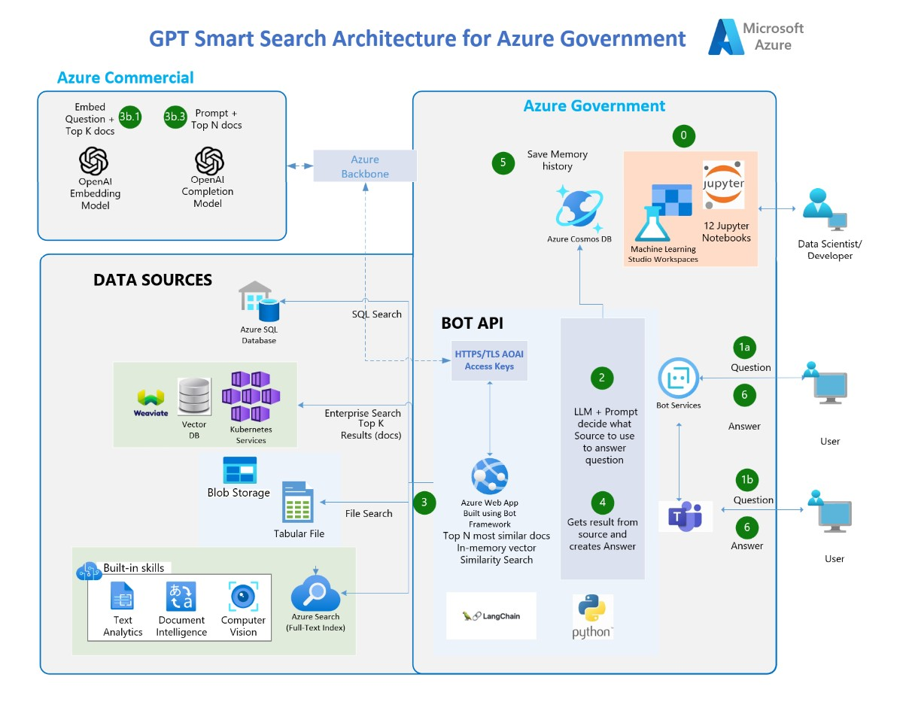

# GPT Powered Search Accelerator built for Azure Government Customers 
# Azure OpenAI + Bot Framework + Langchain + Azure SQL + CosmosDB + Vector Store

[](https://vscode.dev/redirect?url=vscode://ms-vscode-remote.remote-containers/cloneInVolume?url=https://github.com/FEDCSUMission/)

Your organization requires a Multi-Channel Smart Chatbot and a search engine capable of comprehending diverse types of data scattered across various locations. Additionally, the conversational chatbot should be able to provide answers to inquiries, along with the source and an explanation of how and where the answer was obtained. In other words, you want **private and secured ChatGPT for your organization that can interpret, comprehend, and answer questions about your business data**.

This repo helps you accelerate your solution for building enterprise GPT Virtual Assistant built with Azure Services, with your own data in your own environment. The solution consists of:

1. Backend Bot API built with Bot Framework and exposed to multiple channels (Web Chat, MS Teams, SMS, Email, Slack, etc)
2. Frontend web application with a Search and a Bot UI.

The repo is made to teach you step-by-step on how to build an OpenAI based Smart Search Engine. Each Notebook builds on top of each other and ends in building the two applications.

---
**Prerequisites**
* Azure subscription
* Accepted Application to Azure Open AI, including GPT-4 (mandatory)
* A Resource Group (RG)  needs to be set for this Workshop POC, in the customer Azure tenant
* A storage account must be set in place in the RG.
* Data/Documents must be uploaded to the blob storage account
* For IDE collaboration during workshop, Jupyper Lab will be used, for this, Azure Machine Learning Workspace must be deployed in the RG
   * Note: Please ensure you have enough core compute quota in your Azure Machine Learning workspace 

---
# Architecture 


## Flow
1. The user asks a question.
2. In the app, an OpenAI LLM uses a clever prompt to determine which source contains the answer to the question.
3. Four types of sources are available:
   * 3a. Azure SQL Database - contains COVID-related statistics in the US.
   * 3b. External Vector DB - contains AI-enriched documents from Blob Storage (10k PDFs and 52k articles).
      * 3b.1. Uses an LLM (OpenAI) to vectorize the top K document chunks from 3c.
      * 3b.2. Uses in-memory cosine similarity to get the top N chunks.
      * 3b.3. Uses an OpenAI GPT model to craft the response from the Cog Search Engine (3c) by combining the question and the top N chunks.
   * 3c. CSV Tabular File - contains COVID-related statistics in the US.
4. The app retrieves the result from the source and crafts the answer.
5. The tuple (Question and Answer) is saved to CosmosDB to keep a record of the interaction.
6. The answer is delivered to the user.

---
## Demo

https://webapp-frontend-rylu5pcprg6ja.azurewebsites.us/

To open the Bot in GCC-H MS Teams, click [HERE](https://teams.microsoft.us/l/chat/0/0?users=28:5d583679-8196-4673-9d77-c294c010bca5)

---

## 🔧**Features**

   - Implements the AOAI application hosted in Azure Government cloud connecting to Azure OpenAI instance in Azure Commercial cloud, based on the recommended Microsoft architecture.
   - Enables search/chat experience throuhg Microsoft Teams through the [Bot Framework](https://dev.botframework.com/) and [Bot Service](https://azure.microsoft.com/en-us/products/bot-services/).
   - 100% Python.
   - Incorporates an external vector store (weaviate)
   - Uses [LangChain](https://langchain.readthedocs.io/en/latest/) as a wrapper for interacting with Azure OpenAI , vector stores, constructing prompts and creating agents.
   - Tabular Data Q&A with CSV files and SQL Databases
   - Uses CosmosDB as persistent memory to save user's conversations.
   - Uses [Streamlit](https://streamlit.io/) to build the Frontend web application in python.
   - Optional: Uses [Azure Cognitive Services](https://azure.microsoft.com/en-us/products/cognitive-services/) to index and enrich unstructured documents: Detect Language, OCR images, Key-phrases extraction, entity recognition (persons, emails, addresses, organizations, urls).

   

---

## **Steps to Run the POC/Accelerator**

Note: (Pre-requisite) You need to have an Azure OpenAI service already created

1. Fork this repo to your Github account.
2. In the Azure Commercial cloud in Azure OpenAI studio, deploy these two models: **Make sure that the deployment name is the same as the model name.**
   - "gpt-35-turbo" for the model "gpt-35-turbo (0301)". If you have "gpt-4", use it (it is definitely better)
   - "text-embedding-ada-002"
3. In the Azure Government cloud, create a Resource Group where all the assets of this accelerator are going to be. Use the Azure OpenAI endpoints and keys to configure and deploy the resources in Azure Government.
4. ClICK BELOW to create all the Azure Infrastructure needed to run the Notebooks (Cognitive Services, SQL Database, CosmosDB):

[](https://portal.azure.com/#create/Microsoft.Template/uri/https%3A%2F%2Fraw.githubusercontent.com%2FFederalCSUMission%2FAzure-OpenAI-Accelerator-Federal%2Fdavyu_updateAppAzureGov%2Fazuredeploy.json) 

**Note**: If you have never created a `Cognitive services Multi-Service account` before, please create one manually in the azure portal to read and accept the Responsible AI terms. Once this is deployed, delete this and then use the above deployment button.

5. Clone your Forked repo to your local machine or AML Compute Instance. If your repo is private, see below in Troubleshooting section how to clone a private repo.

6. Make sure you run the notebooks on a **Python 3.10 conda enviroment**
7. Install the dependencies on your machine (make sure you do the below pip comand on the same conda environment that you are going to run the notebooks. For example, in AZML compute instance run:
```
conda activate azureml_py310_sdkv2
pip install -r ./common/requirements.txt
```
9. Edit the file `credentials.env` with your own values from the services created in step 4.
10. **Run the Notebooks in order**. They build up on top of each other.

---

<details>

<summary>FAQs</summary>
  
## **FAQs**

1. **Why do we use Prompt Engineering rather than the fine-tune approach?**

A: Quoting the [OpenAI documentation](https://platform.openai.com/docs/guides/fine-tuning): "GPT-3 has been pre-trained on a vast amount of text from the open internet. When given a prompt with just a few examples, it can often intuit what task you are trying to perform and generate a plausible completion. This is often called "few-shot learning.
Fine-tuning improves on few-shot learning by training on many more examples than can fit in the prompt, letting you achieve better results on a wide number of tasks. Once a model has been fine-tuned, you won't need to provide examples in the prompt anymore. This **saves costs and enables lower-latency requests**"

However, fine-tuning the model requires providing hundreds or thousands of Prompt and Completion tuples, which are essentially query-response samples. The purpose of fine-tuning is not to give the LLM knowledge of the company's data but to provide it with examples so it can perform tasks really well without requiring examples on every prompt.

There are cases where fine-tuning is necessary, such as when the examples contain proprietary data that should not be exposed in prompts or when the language used is highly specialized, as in healthcare, pharmacy, or other industries or use cases where the language used is not commonly found on the internet.
</details>

<details>

<summary>Troubleshooting</summary>
  
## Troubleshooting

Steps to clone a private repo:
- On your Terminal, Paste the text below, substituting in your GitHub email address. [Generate a new SSH key](https://docs.github.com/en/authentication/connecting-to-github-with-ssh/generating-a-new-ssh-key-and-adding-it-to-the-ssh-agent#generating-a-new-ssh-key).
```bash
ssh-keygen -t ed25519 -C "your_email@example.com"
```
- Copy the SSH public key to your clipboard. [Add a new SSH key](https://docs.github.com/en/authentication/connecting-to-github-with-ssh/generating-a-new-ssh-key-and-adding-it-to-the-ssh-agent#generating-a-new-ssh-key).
```bash
cat ~/.ssh/id_ed25519.pub
# Then select and copy the contents of the id_ed25519.pub file
# displayed in the terminal to your clipboard
```
- On GitHub, go to **Settings-> SSH and GPG Keys-> New SSH Key**
- In the "Title" field, add a descriptive label for the new key. "AML Compute". In the "Key" field, paste your public key.
- Clone your private repo
```bash
git clone git@github.com:YOUR-USERNAME/YOUR-REPOSITORY.git
```
</details>


